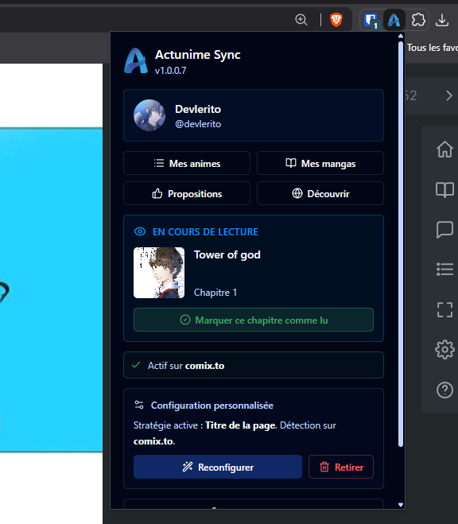
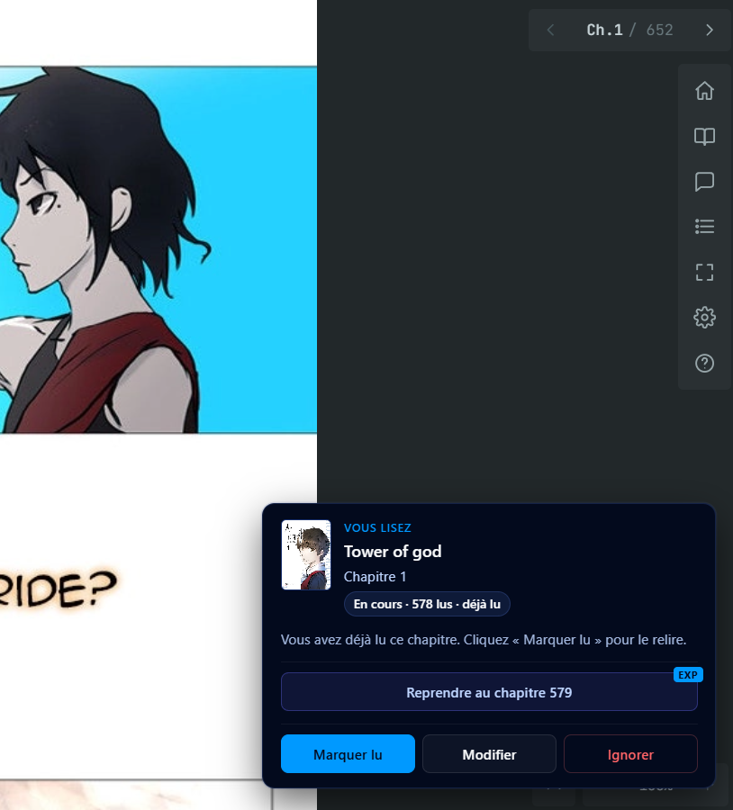
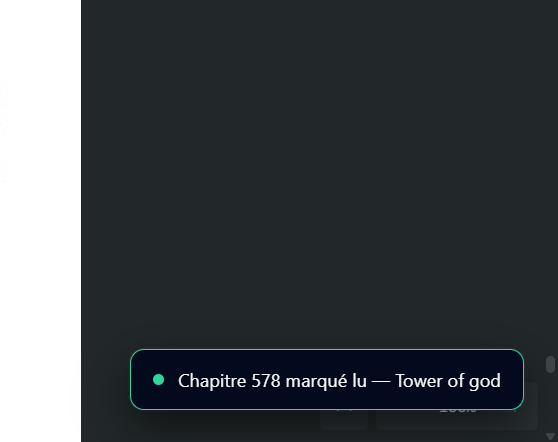
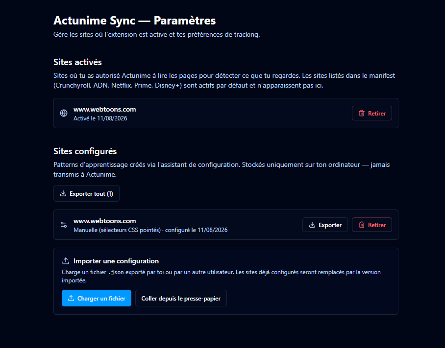

# Actunime Sync

> Extension navigateur de synchronisation automatique des animes & mangas avec [Actunime](https://actunime.fr).

[](LICENSE)
[](https://github.com/Actunime/Actunime-Sync/releases)
[](https://developer.chrome.com/docs/extensions/develop/migrate/what-is-mv3)

Actunime Sync détecte automatiquement les épisodes que tu regardes sur les sites
de streaming et synchronise ta progression avec ta liste Actunime — sans copier-coller,
sans clic à chaque épisode.

## Fonctionnalités

- **Mise à jour automatique** de ta liste Actunime au fil de tes visionnages, ou
  marquage immédiat depuis le popup via le bouton « Marquer vu ».
- **Configuration par site** via un assistant qui teste 4 stratégies de détection
  (JSON-LD / Open Graph / tokens d'URL / sélecteurs DOM) — fallback sélecteur
  visuel pour pointer manuellement le titre et l'épisode dans la page.
- **Contribution rapide** : si une œuvre n'est pas encore dans Actunime, un mini
  formulaire dans le popup permet de la proposer en quelques secondes ; elle est
  ajoutée à ta liste immédiatement (en attente de validation par les modérateurs).
- **Dédup communautaire** : si plusieurs utilisateurs proposent la même œuvre,
  l'extension les agrège automatiquement en un seul appui sur la proposition existante.
- **Export / import** des configurations de sites en JSON pour partager avec
  d'autres utilisateurs.
- **Aucun pattern précâblé** : tout est configuré par toi (ou importé depuis un
  partage communautaire). L'extension n'embarque aucune connaissance préalable
  des sites.
- **Notification de mise à jour** : l'extension vérifie quotidiennement les
  nouvelles releases sur GitHub et te prévient quand une mise à jour est dispo.

### Aperçu

| | |
|---|---|
|  |  |
| Détection active, épisode en cours reconnu | Confirmation d'un chapitre en un clic |
|  |  |
| Ta liste se met à jour instantanément | Sites configurés, export/import JSON |

La configuration par site en vidéo — l'assistant teste automatiquement les 4 stratégies
de détection, et permet une configuration manuelle si aucune ne suffit (couvre environ
90 % des sites) :

<video src="https://github.com/user-attachments/assets/c39d2b22-0f08-4b25-8598-702195fa8555" controls muted playsinline width="720"></video>

## Installation

### Pour les utilisateurs (release stable)

L'installation en vidéo (téléchargement → mode développeur → extension chargée et connectée) :

<video src="https://github.com/user-attachments/assets/45501eda-28c3-4f38-b269-bdee460b4ffa" controls muted playsinline width="720"></video>

1. Télécharge la dernière `actunime-sync-vX.Y.Z.zip` depuis la page
   [Releases GitHub](https://github.com/Actunime/Actunime-Sync/releases/latest).
2. Décompresse l'archive dans un dossier dédié.
3. Ouvre `chrome://extensions` (ou `edge://extensions`).
4. Active le **Mode développeur** (interrupteur en haut à droite).

   > Chrome affiche alors un bandeau *« Désactiver les extensions en mode
   > développeur »* — c'est normal et attendu pour **toute** extension chargée
   > hors du Chrome Web Store, pas un signe de danger. Il ne bloque rien ; tu
   > peux continuer l'installation.

5. Clique **« Charger l'extension non empaquetée »** et sélectionne le dossier décompressé.
6. Connecte-toi à Actunime depuis le popup de l'extension.
7. Visite un site de streaming, clique l'icône Actunime Sync dans la barre d'outils,
   puis **« Ajouter ce site »** — l'assistant de configuration s'ouvre.

> **Mises à jour** : tant que l'extension n'est pas publiée sur le Chrome Web
> Store, elle ne se met pas à jour automatiquement. L'extension détecte
> elle-même les nouvelles versions sur GitHub Releases (check quotidien) et
> affiche un bandeau dans le popup avec un lien direct vers la dernière `.zip`.
> Il suffit alors de remplacer le contenu du dossier décompressé puis de
> recharger l'extension dans `chrome://extensions`.

### Pour les développeurs

Aucune dépendance privée, aucun token GitHub à configurer. Clone, install, build :

```bash
git clone https://github.com/Actunime/Actunime-Sync.git
cd Actunime-Sync
pnpm install
pnpm build --mode development
```

Crée un fichier `.env.development` à la racine avec les URL de l'API et du site Actunime que tu utilises (par défaut le local) :

```env
VITE_API_URL=http://localhost:3000
VITE_WEB_URL=http://localhost:3002
```

Charge ensuite le dossier `dist/` via `chrome://extensions` comme ci-dessus.

Pour le développement avec hot-reload :

```bash
pnpm dev
```

Pour régénérer les icônes (16, 32, 48, 128 px) à partir de `public/icons/source.png` :

```bash
pnpm build:icons
```

## Architecture

L'extension est en **Manifest V3** avec quatre contextes d'exécution :

| Contexte | Rôle | Stack |
|---|---|---|
| **Popup** | UI rapide : détection, suivi, contribution | React + Tailwind |
| **Options** | Configuration globale, sites & patterns | React + Tailwind |
| **Service worker** | Auth, appels API, matching, coordination | TypeScript pur |
| **Content script** | Détection in-page, observateurs vidéo/audio, overlays | Vanilla TS + Shadow DOM |

Voir la [documentation contributeur](CONTRIBUTING.md) pour plus de détails sur la
structure du code, le flow de configuration par site et les règles de matching.

## Confidentialité

- Aucun tracking publicitaire, aucune télémétrie.
- Les **patterns appris localement** (mode manuel) ne quittent **jamais** ton
  navigateur sauf si tu les exportes explicitement en JSON.
- Seules les progressions d'épisodes (titre + numéro) sont envoyées à l'API Actunime,
  exactement comme si tu cliquais « marqué vu » sur le site.
- Le code source est intégralement public et auditable.

## Licence

Dépôt **source disponible**, pas open source : le code est public pour que tu
puisses le lire, l'auditer et le builder toi-même, mais sa réutilisation
(redistribution, fork, projet dérivé, usage commercial) reste soumise à
autorisation. Détails dans [LICENSE](LICENSE).

Le **nom « Actunime » et le logo sont des marques** de leur propriétaire et ne
sont couverts par aucune des autorisations du dépôt.

## Liens

- 🌐 Site Actunime : [beta.actunime.fr](https://beta.actunime.fr)
- 📦 Releases : [github.com/Actunime/Actunime-Sync/releases](https://github.com/Actunime/Actunime-Sync/releases)
- 🐛 Bugs & demandes : [Issues GitHub](https://github.com/Actunime/Actunime-Sync/issues)
- 🤝 Contribuer : [CONTRIBUTING.md](CONTRIBUTING.md)
- 📝 Historique : [CHANGELOG.md](CHANGELOG.md)
